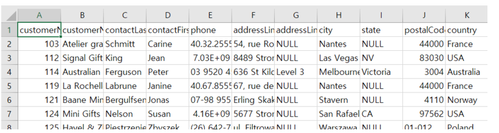
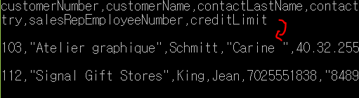
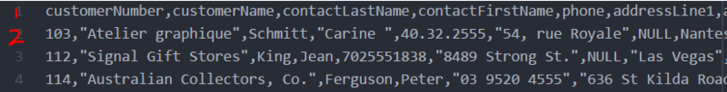

# CSV

- Comma Separate Value
- 필드를 쉼표로 구분한 텍스트파일
- 엑셀 양식의 데이터를 프로그램에 상관없이 쓰기 위한 데이터 형식

엑셀 양식(.xlsx)의 데이터는 Binary파일이다. 반면 CSV는 Text파일이다. 텍스트 파일은 여러 프로그램에서 데이터를 읽어오기에 용이하다.

## csv파일 내용 읽기

- with문을 사용한 소스 코드

```python
import csv

with open('some.csv', 'r') as f:
    reader = csv.reader(f)
    header = next(reader) # 헤더 부분을 생략하고 싶은 경우

for row in reader:
    print row # 한줄씩 읽어오기
```

- with문을 사용하지 않은 소스 코드

```python
import csv

f = open('some.csv', 'r')

reader = csv.reader(f)
header = next(reader)
for row in reader:
    print row

f.close()
```

with문을 사용하지 않으면 마지막에 close를 써야한다.

## csv파일 내용 쓰기 파일 출력

- with문을 사용한 소스 코드

```python
import csv

with open('some.csv', 'w') as f:
    writer = csv.writer(f, lineterminator='\n') # 줄 바꿈 코드(\n)을 지정
    writer.writerow(list) # list가 1차원 배열의 경우
    writer.writerows(array2d) # 2차원 배열일 경우에도 파일 출력 가능
```

- with문을 사용하지 않은 소스 코드

```python
import csv

f = open('some.csv', 'w')

writer = csv.writer(f, lineterminator='\n')
writer.writerow(list)
writer.writerows(array2d)

f.close()
```

with문을 사용하지 않으면 마지막에 close를 써야한다

## 예제



위와같은 CSV파일을 사용하였다.

```python
line_counter = 0
header = []
customer_list = []

with open('customers.csv') as f:
    while 1:
        data = f.readline()
        print(data) # data에 파일을 한 줄씩 불러옴
        if not data: break 
        if line_counter == 0:
            header = data.split(",") # 맨 첫 줄은 header로 저장
        else:
            customer_list.append(data.split(","))
        line_counter += 1
```



- 출력된 데이터를 보면 줄바꿈(\n)이 두번 들어갔다.
- 1.이는 데이터를 쓸때 맨끝에 반드시 줄바꿈 기호가 들어가기 때문이다
- 2.그리고 print문 때문에 줄바꿈이 한번더 되었다.
- 이를 하나를 제거하기위해 아래의 문장을 넣어주었다.

```python
data = f.readline().replace("\n","") # 줄바꿈기호 하나 제거
```



- 1번 줄에는 필드명,  (2,3,4)줄에는 데이터가 들어갔다.
- 위의 코드를 사용하면 header변수에 필드명이 list형식으로 저장된다.
- 즉 header에는 ['customerNumber', 'customerName', 'contactLastName',....] 값이 들어있다.
- 원래는 'customerNumber, customerName, contcactLastName'... 의 하나의 string값이다.
- 마찬가지로 customer_list에도 각각의 행이 쉼표를 기준으로 나뉘어 리스트로 저장된 값들이 들어가 있다.

[참조](https://m.blog.naver.com/PostView.nhn?blogId=real_77&logNo=221200151992&proxyReferer=https:%2F%2Fwww.google.com%2F)